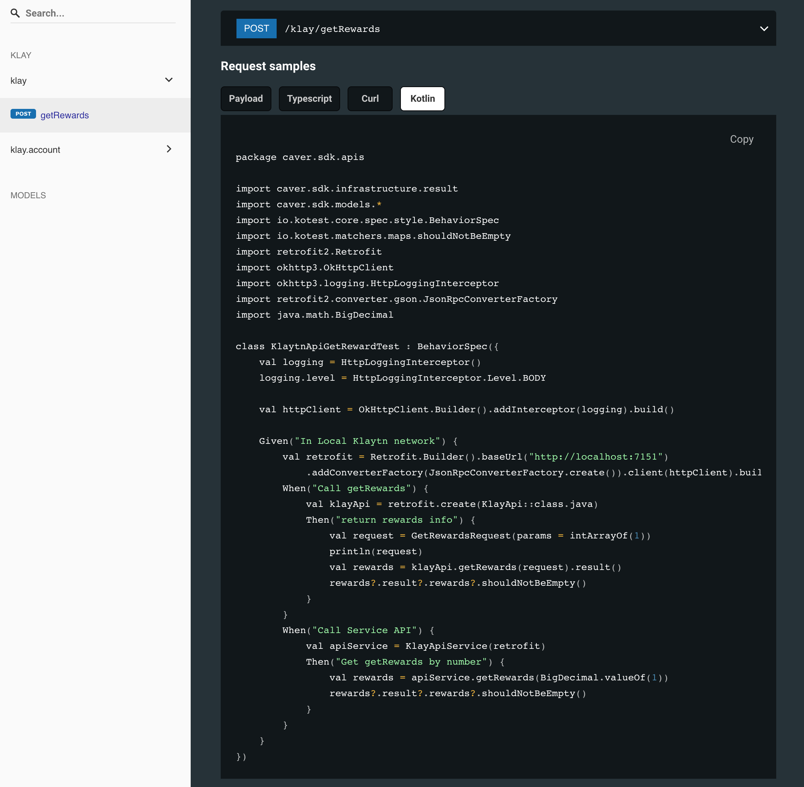

## SDK

- Create SDK for each development language
- Currently implemented languages include typescript, kotlin, java, and javascript for clients.
- Separate SDK into client and server
- Describes how to develop an SDK based on kotlin

### Template

Use [mustache](https://mustache.github.io/mustache.5.html) template. It may change to [Handlebars](https://handlebarsjs.com/) someday.

For each language, the mustache template provided by the OpenAPI generator is used.

You need the jvm-retorfit2 template files to use the retrofit2 library.

- libraries/jvm-retrofit2/api.mustache
    - Adding the api.mustache file overrides the existing api.mustache file.
    - Copy and modify the api.mustache file in [openapi-generator](https://github.com/OpenAPITools/openapi-generator/blob/master/modules/openapi-generator/src/main/resources/kotlin-client/libraries/jvm-retrofit2/api.mustache ). 
- libraries/jvm-retrofit2/bodyParamJavadoc.mustache
    - bodyParamJavadoc is the newly added mustache file
    - Add description of bodyParam
- libraries/jvm-retrofit2/infrastructure/ResponseExt.kt.mustache
    - Copy and modify the ResponseExt.kt.mustache file in [openapi-genrator](https://github.com/OpenAPITools/openapi-generator/blob/master/modules/openapi-generator/src/main/resources/kotlin-client/libraries/jvm-retrofit2/infrastructure/ResponseExt.kt.mustache).

### .openapi-generator-ignore

- Use a gitignore pattern in case you want to exclude among the files created by generator
- If you do not want to generate the `GetRewardsRequestAllOf.kt` file among the files generated by the kotlin generator, add the **/*AllOf.kt filter out condition.

### openapi

- Directory automatically created by generator
- It is not recommended to create custom code in the openapi directory.
- It is recommended to delete and re-create each time you run generator.
- If there are necessary utils or features, it is recommended to create an additional module and test after configurign in openapi-test

### openapi-test

- Use the package built in openapi. Assuming that `openapi package` is distributed in the `maven repository`, configure the jar file.
- build.gradle.kts

- It is recommended to test javascript or typescript in an environment distributed with npm
- Create separate test files for each API. It is used in samples when defining OpenAPI spec.

